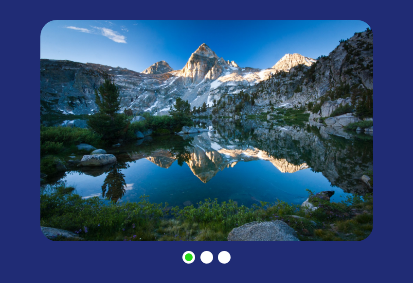

# Slider-library

Это моя маленькая библиотека интересных интерактивных элементов, которые вы можите
заметить на многих лендинг-страницах, интернет-магазинов и так далее, которые я попытался создать вручную.

**Сcылка на проект:** https://vadim-astapov-1.github.io/slider-library/index.html

## Описание

Проект написан на фреймворке **React** с использованием javascript, html, css без каких либо дополнительных библиотек.

## Содержание

- ### Flex-slider

Это раздвижной слайдер похожий на панораму. Сначало при наведении на сам контейнер слайдера, уменьшаются изображения при помощи *flex-basis*. Далее при попадании курсора на картинку, она расширяется, используя это же свойство и сам контейнер увеличивается в размере вместе с ней.

#### Примечания

В данном элементе не используется javascript. Всю магию делает css.

- ### Slow-slider

Стандартный, типичный слайдер, который можно часто увидеть в интернете. Выравниваем картинки в блоке по горизонтали и перематывает блок с помощью *transform: translateX*. Каждое из трёх изображений имеет свой - position, в зависимости от которого на сколько пикселей сдвинится лист с картинками.

#### Примечания

Слайды также меняются при нажатиии на сам слайдер. В ином случае они сменятся по таймеру.

- ### Long-slider

Так называемый слайдер - карусель с бесконечной сменой слайдов. При скролле налево, блок изменит свои координаты с помощью *transform: translateX*. Самое интересное происходит при скролле направо. Так как блок всегда стоит с *translateX(0)*, после нажатия на кнопку, перестраиватся массив, меняя слайды местами и установкой начальной координаты на уже сдвинутое состояние. После чего он просто снова возвращается к координате 0.

#### Примечания

:white_check_mark: Fix: переключение слайдов без анимации при многоклике

